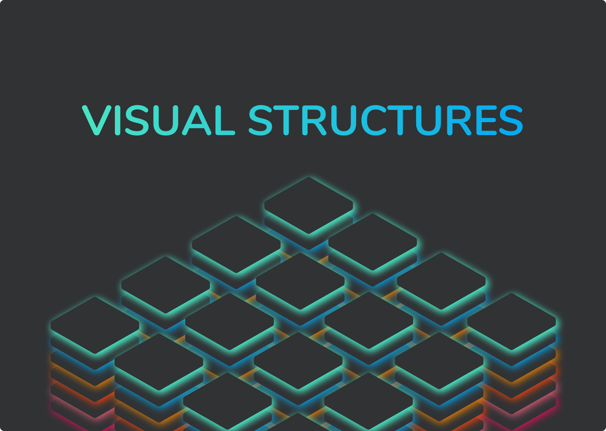

# Visual Structures



<p align="center">
  <a href="https://github.com/visual-structures/visual-structures/releases/" target="_blank">
    
  </a>

  <a href="https://github.com/tsamantanis/visual-structures/commits/master" target="_blank">
    
  </a>

  <a href="https://github.com/tsamantanis/visual-structures/issues" target="_blank">
    
  </a>

  <a href="https://github.com/tsamantanis/visual-structures/pulls" target="_blank">
    
  </a>

  </br>

  <a href="https://github.com/visual-structures/visual-structures#contribute" target="_blank">
    
  </a>

  <a href="https://standardjs.com" target="_blank">
    
  </a>

  <a href="https://github.com/visual-structures/visual-structures/blob/master/LICENSE" target="_blank">
    
  <a/>
</p>
<hr>

Implementation and visual representation of commonly used data structures.


# Table of contents

- [Project Title](#project-title)
- [Demo-Preview](#demo-preview)
- [Table of contents](#table-of-contents)
- [Installation](#installation)
- [Usage](#usage)

# Installation
[(Back to top)](#table-of-contents)


To use this project, first clone the repo on your device using the commands below:

```git init```

```git clone https://github.com/tsamantanis/visual-structures.git```

```cd visual-structures```

```npm install```

# Usage
[(Back to top)](#table-of-contents)

```npm run start```
